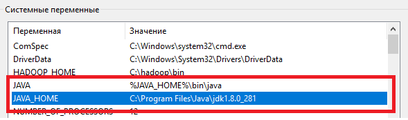
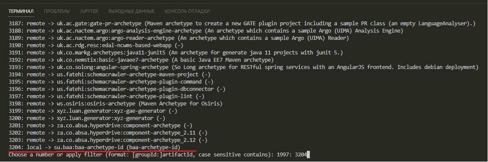
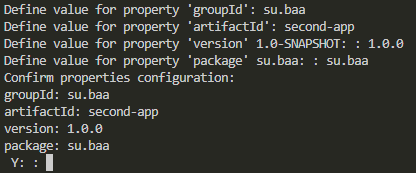
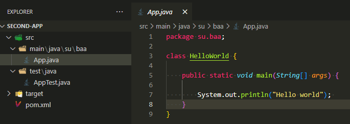

### Установка maven

Качаем архив с maven:

https://maven.apache.org/download.cgi

распаковываем, например, сюда:
    
    C:\Program Files\apache-maven-3.8.7    

В переменные среды в PATH добавляем:

    C:\Program Files\apache-maven-3.8.7\bin

Теперь в терминале проверяем:

    mvn -v

вывод:

    Apache Maven 3.8.7 (b89d5959fcde851dcb1c8946a785a163f14e1e29)
    Maven home: C:\Program Files\apache-maven-3.8.7
    Java version: 1.8.0_281, vendor: Oracle Corporation, runtime: C:\Program Files\Java\jdk1.8.0_281\jre
    Default locale: ru_RU, platform encoding: Cp1251
    OS name: "windows 10", version: "10.0", arch: "amd64", family: "windows"

Путь runtime:

    C:\Program Files\Java\jdk1.8.0_281

Должен совпасть с переменной окружения JAVA_HOME:


### Быстрый старт

копируем этот репозиторий

    git clone https://github.com/lod2007/archetype.git

в корне открываем терминал и устанавливаем архетип

    mvn install

Далее [Переходим к пункту 4.](###Создание-нового-проекта-на-основе-своего-архетипа) 
или можем на примере создать свой архетип, читаем дальше.

### Свой Архетип для Java проектов

1. Создаем проект как описано тут:

https://maven.apache.org/guides/mini/guide-creating-archetypes.html

Структура и копируемые файлы задаются в каталоге:

    src\main\resources\archetype-resources

2. Для основного файла своих проектов используем pom.xml (в место файла "3. Create the prototype files and the prototype pom.xml"):

его путь:
    
    src\main\resources\archetype-resources\pom.xml

содержимое pom.xml:
```
   <project xmlns="http://maven.apache.org/POM/4.0.0" xmlns:xsi="http://www.w3.org/2001/XMLSchema-instance"
    xsi:schemaLocation="http://maven.apache.org/POM/4.0.0 https://maven.apache.org/xsd/maven-4.0.0.xsd">
    <modelVersion>4.0.0</modelVersion>
 
    <groupId>su.baa</groupId>
    <artifactId>first-app</artifactId>
    <version>1.0.1</version>
    <packaging>jar</packaging>
 
    <name>first-app</name>
    <url>https://baa.su</url>
 
    <dependencies>
        <dependency>
                <groupId>junit</groupId>
                <artifactId>junit</artifactId>
                 <version>4.12</version>
                <scope>test</scope>
        </dependency>
    </dependencies>
    <build>
        <plugins>
            <plugin>
            <!-- Build an executable JAR -->
            <groupId>org.apache.maven.plugins</groupId>
            <artifactId>maven-jar-plugin</artifactId>
            <version>3.1.0</version>
            <configuration>
                <archive>
                <manifest>
                    <addClasspath>true</addClasspath>
                    <classpathPrefix>lib/</classpathPrefix>
                    <mainClass>su.baa.HelloWorld</mainClass>
                </manifest>
                </archive>
            </configuration>
            </plugin>
        </plugins>
    </build>
</project>
```

3. Для установки своего архетипа в локальную систему нужно выполнить команду:
```    
    mvn install
```
### Создание нового проекта на основе своего архетипа

4. Для создания проекта по архетипу создаем в новом каталоге выполняем команду:
```
mvn archetype:generate
```
выбираем локальный проект 3204 (у вас может быть другой номер):

    3204: local -> su.baa:baa-archetype-id (baa-archetype-id)



groupId - группа проектов: su.baa
artifactId - название текущего проекта: second-app
version - версия: 1.0.0
package - название пакета: su.baa
Жмём: Y


альтернотивно тоже самое можно выполнить одной командой:

    mvn archetype:generate -DarchetypeGroupId=su.baa -DarchetypeArtifactId=baa-archetype-id -DarchetypeVersion=1.0.0 -DgroupId=su.baa -DartifactId=new-app -Dversion=1.0
первые три параметра - не менять, а остальные три отвечают за название и версию создаваемого приложения.

### Тестовый запуск созданного проекта на примере "Hello World"

5. В получившемся проекте, в файле **App.java** можно написать "Hello World":
```
package su.baa;

class HelloWorld {

    public static void main(String[] args) {

        System.out.println("Hello world"); 
    }
}
``` 


6. В корне проекта в терминале выполняем:

```
    mvn clean package
```
Создается папка target, в которой формируется jar-файл.

7. Выполнить jar-файл можно командой (нужно перейти в папку target):
```
java -cp second-app-1.0.0.jar su.baa.HelloWorld
```
или (из того же терминала, где делали  mvn clean package):
```
java -cp target/second-app-1.0.0.jar su.baa.HelloWorld
```
